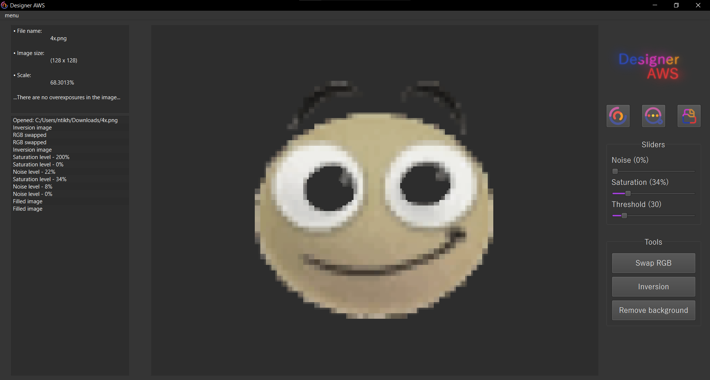

# Image Processing Studio

English | [Русский](README-RU.md)

A Qt/C++ based application for advanced image processing with an intuitive graphical interface.

## Interface

<div style="display: flex; justify-content: center; margin-bottom: 20px;">
  
</div>

## Features

- **Image Loading**
  - Single image processing
  - Multiple images processing with averaging
  - Drag & Drop support
  
- **Image Processing Tools**
  - Noise generation with adjustable intensity
  - Saturation control
  - RGB channel swapping
  - Color inversion
  - Background removal with flood fill algorithm
  - Threshold adjustment for background removal

- **Image Analysis**
  - Image size information
  - Scale information
  - Overexposure analysis
  - Real-time parameter adjustment

## Requirements

- Qt 6.7.0 or higher
- C++ compiler with C++17 support
- CMake 3.15 or higher (for building)

## Technical Specifications

### Architecture
- Modern C++ standards implementation
- Layer-based image processing using QMap
- Sequential effect application system
- Optimized processing algorithms
- Enhanced graphics rendering capabilities

### Supported Formats
- Common formats: PNG, JPG, BMP
- Binary image formats
- High-resolution images
- Multi-layer images

### Performance
- Real-time image analysis
- Efficient memory management
- Optimized rendering system
- Multi-image processing capabilities

## Installation

### Quick Installation (Windows)

The easiest way to install the application is to use our installer which includes all required dependencies:

1. Download the latest installer from our [Releases page](https://github.com/roazanas/cpp_creative_designerAWS/releases/tag/release)
2. Run the installer and follow the installation wizard
3. Launch the application from the Start menu or desktop shortcut

### Building from Source

1. Clone the repository:
```bash
git clone https://github.com/roazanas/designerAWS.git
cd designerAWS
```

2. Open the project in Qt Creator:
   - Launch Qt Creator
   - Open the `designerAWS.pro` file
   - Configure the project for your Qt version
   - Build the project

### Running the Application

After successful build, you can find the executable in the build directory. The application requires Qt runtime libraries to be installed on the system.

## Usage Guide

### Basic Operations

1. **Loading Images**
   - Click the "Load" button to select a single image
   - Use "Load Many" to process multiple images
   - Drag and drop images directly into the application window

2. **Image Processing**
   - Use the sliders to adjust:
     - Noise level (0-100%)
     - Saturation (-100% to +100%)
     - Threshold for background removal
   - Toggle buttons for:
     - RGB channel swapping
     - Color inversion
     - Background removal tool

3. **Background Removal**
   - Enable the background removal tool
   - Click on the area you want to remove
   - Adjust threshold for better selection

4. **Saving Results**
   - Click "Save" to export the processed image
   - The original image remains unchanged

## Additional Information

- The application automatically analyzes image properties including overexposure
- Real-time preview of all adjustments
- Support for various image formats (PNG, JPG, BMP, etc.)
- Activity log tracking all operations

## License

This project is part of an academic work and is provided as-is without any warranty.

## Contributing

This is an academic project and currently not open for contributions.
